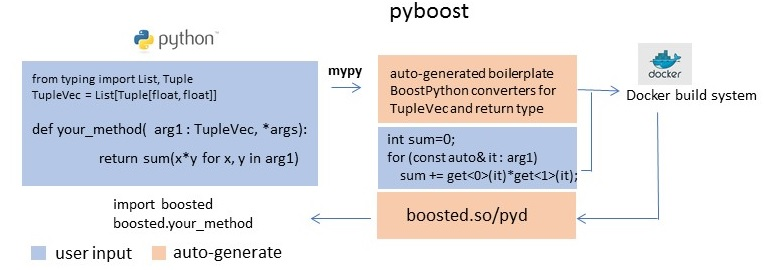

# pyboost

Uses [mypy](https://github.com/python/mypy) to convert Python typehint-assisted defs to C++. 
Generates Boost Python boiler plate and Docker build system. 
YMMV depending on your specific use case. Mainly serves two purposes:

1. Generate and register converters based on type hints, allowing you to focus on translating implementation details. 
2. Reduce the pain point of setting up and compiling Boost Python by providing a docker container. Just copy your Boost Python source and build. 

TODO
=====
Docker:
Use Linux Alpine base image.
user-config.jam heredoc docker syntax.
Cross-compile pyd for win x64.
